<h1 align="center">✨ Website That Surpasses the Heavens ✨</h1>

---

## 🌟 About Me  

### 👋 Hey there, I'm **Arfat Abed**  

💻 **Frontend Developer** | 🌍 From the Arab World | 🚀 Passionate about coding & design  

---

### ✨ What I Do  
- 🎨 Craft modern & responsive websites  
- ⚡ Add smooth animations & interactive UIs  
- 🛠️ Work with **HTML**, **CSS**, **JavaScript**, **Python**  
- 🤝 Love collaborating on **open-source projects**  

---

### 🎯 Goals  
🌱 Keep learning & improving every day  
📂 Build impactful projects that people actually use  
🔥 Become one of the top contributors in open-source  

---

### ⚡ Fun Facts  
- ☕ Coffee is my best coding partner  
- 🎵 I love listening to music while coding  
- 🌌 I believe in creativity & consistency  

---

✨ *"Turning ideas into reality with code."* ✨  

  

---

## 📊 GitHub Stats  
  

---

## 🚀 Skills Progress

---

## 🖥️ Top Languages  
  

---

## ⚡ Skills  

  

---

---

## 👀 Visitors  

---
